<div align="center">
  

  <br/>
  <br/>

  
  
  
</div>

<br/>

---

## Sumário

- [Visão Geral](#visão-geral)
- [Funcionalidades Principais](#funcionalidades-principais)
- [Demonstração de Código](#demonstração-de-código)
- [Teste de Interatividade e Botões](#teste-de-interatividade-e-botões)
- [Suíte de Testes](#suíte-de-testes)
- [Matriz de Compatibilidade](#matriz-de-compatibilidade)

---

## Visão Geral

> [!NOTE]
> Este repositório é um ambiente de testes para prototipação e validação visual de componentes SVG e documentação Markdown.

Lorem ipsum dolor sit amet, consectetur adipiscing elit. Integer nec odio. Praesent libero. Sed cursus ante dapibus diam. Sed nisi. Nulla quis sem at nibh elementum imperdiet. Duis sagittis ipsum.

---

## Funcionalidades Principais

- [x] **Módulo de Parsing:** Processamento de sintaxe genérica para testes.
- [x] **Compilação JIT:** Simulação de performance em tempo de execução.
- [x] **Integração SVG:** Componentes gráficos dinâmicos e adaptáveis.
- [ ] **Otimização de Memória:** Garbage collector em fase de testes.

---

## Demonstração de Código

Exemplo de estrutura de código em Python para testar a renderização do bloco de sintaxe:

```python
class TestSuite:
    def __init__(self, name: str):
        self.name = name
        self.status = "INITIALIZED"

    def run_tests(self) -> dict:
        print(f"Running component validation for {self.name}...")
        return {"passed": 12, "failed": 0, "skipped": 1}

if __name__ == "__main__":
    runner = TestSuite("Linguagem-Programacao")
    results = runner.run_tests()
    print(results)
```
<div align="center">
  
</div>
